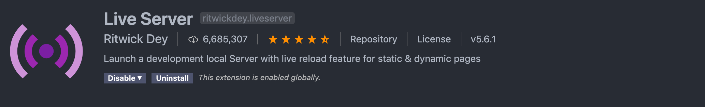
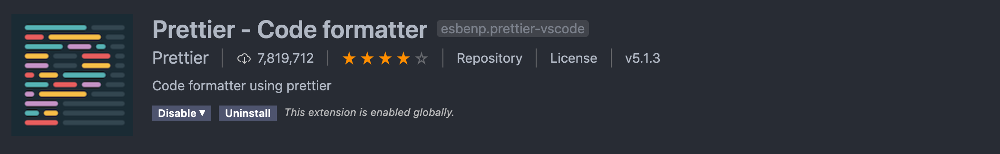
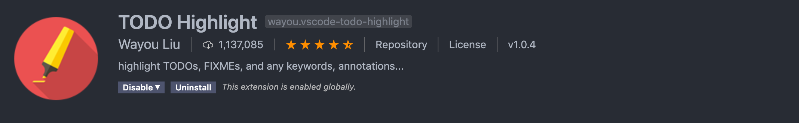
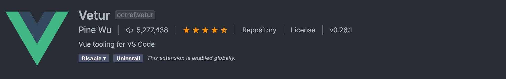
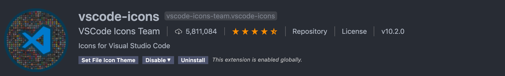

# VS CODE SETUP 👩‍💻

VSCode or Visual Studio Code is one of the most popular source code editor (IDE) used by the developers. Its powerful, fast and lightweight too. It allows us to customize it just as we want. It has a build-in git integration and terminal, so we don’t have to jump from one window to another. In my opinion, it’s a fantastic code editor.

VSCode offers a wide range of extensions and with proper setup of VSCode we can improve our productivity and help us to create better, clean code.

## 🗒Here is the list of must have VS Code Extensions :-

I have divided the extension in 4 categories

- **Html/Css/JavaScript**
- **Utilities**
- **Framework/Library** [for frontent development]
- **Git**
- **Themes & Folder Icon**

 

## 1. Html/Css/JavaScript

### ✍️ [Auto Rename Tag](https://marketplace.visualstudio.com/items?itemName=formulahendry.auto-rename-tag)

Automatically rename paired HTML/XML tag.  

---

### ✍️ [Bracket Pair Colorizer](https://marketplace.visualstudio.com/items?itemName=CoenraadS.bracket-pair-colorizer)

Allows matching brackets to be identified with colours. It helps us to find the closing bracket of the current block of code.  

---

### ✍️ [Color Highlight](https://marketplace.visualstudio.com/items?itemName=naumovs.color-highlight)

Highlight web colors in your editor.  

---

### ✍️ [Quokka.js](https://marketplace.visualstudio.com/items?itemName=WallabyJs.quokka-vscode)

Quokka gives you a JavaScript (and TypeScript) scratchpad in VS Code. This means you can test out a piece of code right there in your favorite editor.  

---

### ✍️ [JavaScript Booster](https://marketplace.visualstudio.com/items?itemName=sburg.vscode-javascript-booster)

Provides various code actions (quick fixes) when editing code in JavaScript (or TypeScript/Flow).  

---

### ✍️ [SCSS IntelliSense](https://marketplace.visualstudio.com/items?itemName=mrmlnc.vscode-scss)

Advanced autocompletion and refactoring support for SCSS.  

---

### ✍️ [Live Server](https://marketplace.visualstudio.com/items?itemName=ritwickdey.LiveServer)

Runs your app on a localhost server.  

 

## 2. Utilities

### ✍️ [ESLint](https://marketplace.visualstudio.com/items?itemName=dbaeumer.vscode-eslint)

ESLint is the linting utility for JavaScript. It checks your code for common errors and lets you know in the editor itself. It’s like a virtual peer who is validating your code while you are writing it.  

---

### ✍️ [Prettier](https://marketplace.visualstudio.com/items?itemName=esbenp.prettier-vscode)

This extension performs the formatting of the JavaScript, CSS and HTML code.  

---

### ✍️ [Indent Rainbow](https://marketplace.visualstudio.com/items?itemName=mrmlnc.vscode-scss)

Adds several colors to every indent tab in the code.It helps to navigate your code with your eyes.  

---

### ✍️ [Path Autocomplete](https://marketplace.visualstudio.com/items?itemName=ionutvmi.path-autocomplete)

Provides paths completion.  

---

### ✍️ [TODO Highlight](https://marketplace.visualstudio.com/items?itemName=wayou.vscode-todo-highlight)

Highlight TODO, FIXME and other annotations within your code.  

 

## 3. Framework/Library [for frontent development]

### ✍️ [ES7 React/Redux/GraphQL/React-Native snippets](https://marketplace.visualstudio.com/items?itemName=dsznajder.es7-react-js-snippets)

Provides you JavaScript and React/Redux snippets in ES7 with Babel plugin features.  

---

### ✍️ [Vetur](https://marketplace.visualstudio.com/items?itemName=octref.vetur)

Vue tooling for VS Code with features like syntax-highlighting, snippet, auto Completion.  

---

### ✍️ [vscode-styled-components](https://marketplace.visualstudio.com/items?itemName=jpoissonnier.vscode-styled-components)

Syntax highlighting and IntelliSense for styled-components.  

 

## 4. Git

### ✍️ [GitLens](https://marketplace.visualstudio.com/items?itemName=eamodio.gitlens)

The most powerful Git extension with tons of features like line and file history, commit searching and many more.  

---

### ✍️ [Git history](https://marketplace.visualstudio.com/items?itemName=donjayamanne.githistory)

View git log, file history, compare branches or commits.  

 

## 5. Themes & Folder Icon

### ✍️ [vscode-icons](https://marketplace.visualstudio.com/items?itemName=vscode-icons-team.vscode-icons)

Bring icons to your Visual Studio Code.  

---

### ✍️ [Winter is Coming Theme](https://marketplace.visualstudio.com/items?itemName=johnpapa.winteriscoming)

---

### ✍️ [Eva Theme](https://marketplace.visualstudio.com/items?itemName=fisheva.eva-theme)

---

### ✍️ [Night Owl](https://marketplace.visualstudio.com/items?itemName=sdras.night-owl)

